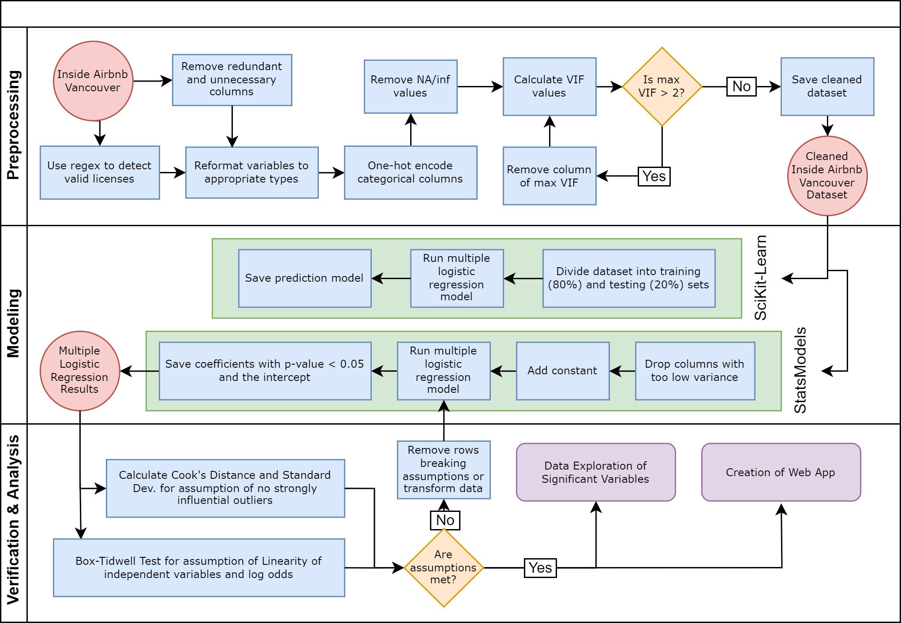

# Predicting Airbnb Licensure in Vancouver

## Overview
This project aims to predict the legality of Airbnb's in Vancouver. Using Airbnb data collected from [InsideAirbnb](http://insideairbnb.com/vancouver) (data/yvr_listing_data.csv). 

Through a multiple logistic regression model, we are able to predict the legality of an Airbnb with an accuracy of 0.90.

The repository has the following main jupyter notebooks:

1. `data_cleaning.ipynb`: This notebook is used to clean the data and prepare it for analysis. The cleaned data is saved as yvr_listing_data_cleaned.csv.

2. `Logistic_Regression_Assumptions.ipynb`: This notebook is used to check the assumptions of the logistic regression model. Modifications from checking the assumptions are saved to yvr_listing_data_cleaned_fixed.csv.

3. `sm_model.ipynb` & `sklearn_model.ipynb`: These notebooks contain the code for the models used to predict the legality of the Airbnb's.

4. `EDA.ipynb`: This notebook contains the code for the exploratory data analysis on the key variables discovered by our logistic regression model.

The repository also contains a `src.py` file which contains the functions used in the notebooks.

All data is stored in the 'data' folder.

## Data Pipeline

